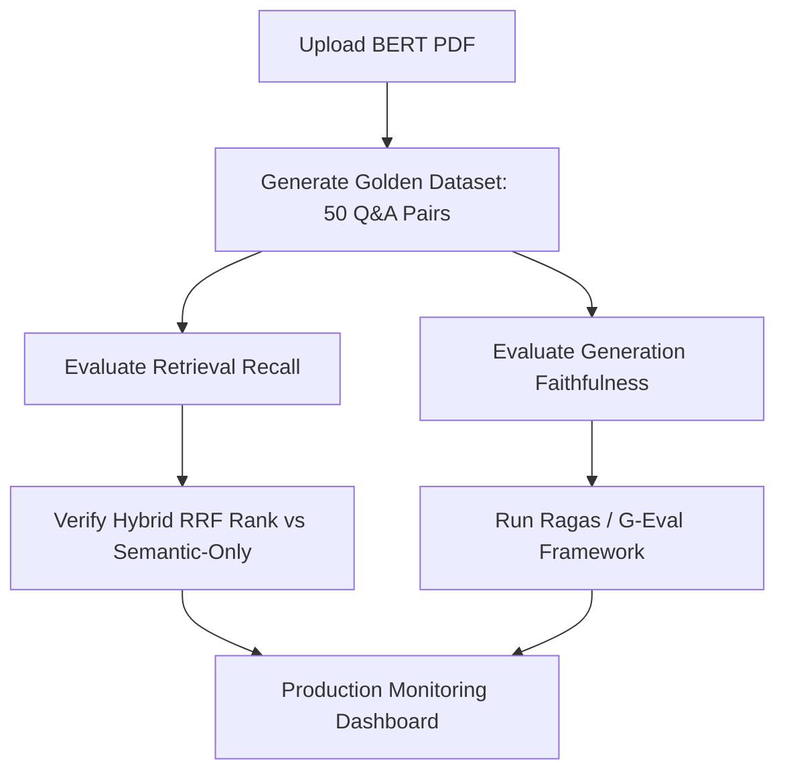

# Strategy Log (STRATEGY.md)

This strategy log outlines the pipeline architecture, ingestion bottlenecks, design decisions, and quality assurance framework for the layout-aware Hybrid RAG platform.

---

## 1. The Discovery & Fix Log

When processing dense, two-column academic papers (like the BERT paper) using standard out-of-the-box text loaders, several critical ingestion failure modes and retrieval bottlenecks were discovered. Below is a breakdown of these issues and how our updated architecture solves them.

| Ingestion Failure Mode / Bottleneck | Impact on RAG System | Technical Fix & Architecture Solution |
| :--- | :--- | :--- |
| **Two-Column Reading Order Break** | Reading text horizontally across the page mixes paragraphs from the left and right columns, resulting in garbled text chunks and coherent answers failing. | We render each PDF page to an image and run Groq's multimodal `llama-3.2-90b-vision-preview` model. The vision parser is explicitly instructed to reconstruct the page following the vertical two-column layout. |
| **Markdown Table Corruptions** | Generic text cleaners stripped whitespace, newlines, and special characters like pipe symbols (`\|`), corrupting Markdown tables into a single line of text. Comparing table numbers became impossible. | We adjusted `TextCleaner.clean` to preserve structural markdown characters (`\|`, `-`, `#`, `*`) and vertical spacing (`\n`), allowing tables to remain in valid Markdown format. |
| **Diagram Semantic Blinding** | Crucial visual flowcharts (like BERT's pre-training vs. fine-tuning in Figure 1, or input representations in Figure 2) contain text inside boxes, colored arrows, and spatial flows that text parsers completely ignore. | We instruct the vision parser to visually transcribe, map, and explain diagrams. It details colors, box titles, connections, and flow directions, placing the context into a Markdown blockquote (`>`) alongside the main text. |
| **Fragmented Sentence Chunking** | Small character chunk sizes (e.g., 1000 chars) split complete thoughts (like pre-training procedures) in half, returning cut-off sentences to the LLM. | We increased the chunk size to `1500` characters with a `300` character overlap to retain complete context, ensuring paragraphs and tables remain intact. |
| **Numeric Comparison Retrieval Failures** | Dense numbers (e.g., specific GLUE scores in Table 1) are poorly embedded by semantic models like `all-MiniLM-L6-v2`. Searching "SQuAD F1 for BERT Large" would pull unrelated text blocks. | We implemented **Hybrid Search**: we query the vector store semantically and concurrently run a fuzzy keyword search (`token_set_ratio` via `rapidfuzz`) to match numeric strings. We combine the lists using **Reciprocal Rank Fusion (RRF)**. |

---

## 2. Design Decisions

### A. Groq Multimodal Vision Parser (`llama-3.2-90b-vision-preview`)
- **Why?** It is the most robust way to parse complex documents containing layout boundaries, dense grids, and structural graphics. 
- **Concurrency & Concurrency Semaphore:** PDF parsing can be slow. We implement concurrent page parsing using Python's `asyncio.gather`. To prevent exceeding Groq's RPM (Requests Per Minute) limits, we enforce an `asyncio.Semaphore(3)` limit.
- **Fail-Safe Fallback:** If the Groq Vision API fails (rate limits, network issues), the code catches the exception and falls back to a layout-aware text extraction using `pdfplumber`, ensuring the upload process is resilient.

### B. Hybrid Retrieval & Reciprocal Rank Fusion (RRF)
- **Why?** Semantic vector search is excellent for abstract conceptual questions, but fails on keyword matches and numerical data. Fuzzy matching (using Levenshtein distance set token matching) is highly accurate for exact strings, tables, and statistics.
- **RRF Integration:** Standardizing rank combining (using $1 / (60 + \text{rank})$) provides a model-agnostic, rank-stable merging of semantic and keyword search result sets without score-scale misalignment.

### C. SQLite Fallback + MongoDB Support
- **Why?** Real-world deployments require standard databases (like MongoDB for metadata/history and MongoDB Compass for inspection). However, developer local setups may lack databases.
- **Solution:** We built a `DualModeCollection` client. On backend startup, it attempts a fast ping to the local MongoDB instance. If successful, it writes data directly to MongoDB. If MongoDB is offline, it falls back to a thread-safe SQLite local DB file (`hybrid_rag.db`), providing zero-config local runs.

### D. Full-Stack Integration & Orchestration
- **Why?** Seamless integration between static asset servers and asynchronous API backends requires zero-config connection mechanisms and robust process lifecycle control.
- **Dynamic API Target Detection:** To minimize local environment configuration friction, the client-side JavaScript (`app.js`) automatically detects the browser host. If it's loaded from standalone local servers (like port `5500` or `3000`), it falls back to routing requests to the default FastAPI endpoint (`http://localhost:8000/api/v1`). In unified containerized environments, it uses relative URL paths to bypass CORS issues entirely.
- **Dual-Process Orchestration:** Launching frontend and backend servers manually is prone to orphaned child processes. The launcher script (`run.py`) wraps both uvicorn and http.server in Python subprocess wrappers. It listens to system interrupts (e.g., `Ctrl+C`) and gracefully shuts down both servers in a unified teardown hook.
- **Marked.js Client Markdown Rendering:** The layout-aware agent parses complex structural contents (e.g., tables and blockquotes) and outputs markdown. Using a CDN-loaded instance of `marked.js` inside `index.html` allows us to render clean, semantic HTML tables and citation blockquotes styled directly by the stylesheet.
- **JWT-Protected Tenant Isolation:** Rather than exposing a shared vector index and document repository, every core RAG operation is guarded by stateless JWT token authentication. Document indexes, metadata DB entries, extracted PDF figures, and chat histories are stamped with the active user's unique ID. This enables multi-tenant security and isolates user workspaces.

---

## 3. Quality Assurance (QA) Framework

To systematically verify retrieval accuracy, recall, and response reliability in production, we propose the following QA strategy:

1. **Golden Evaluation Dataset:**
   - Synthesize a golden set of 50 complex multi-hop questions and exact answers across three domains: Tabular Data (GLUE/SQuAD tables), Diagram Logic (Figure 1/Figure 2 flows), and Textual Nuance (Pre-training objectives).
2. **Retrieval Metrics (Recall@K and MRR):**
   - Measure **Recall@K** (is the correct ground-truth chunk in the retrieved top-K chunks?) and **Mean Reciprocal Rank (MRR)**. We benchmark the hybrid semantic-fuzzy search against a baseline semantic-only vector store.
3. **Generation Metrics (Faithfulness & Answer Relevance):**
   - Use the **Ragas** library or **G-Eval (LLM-as-a-judge)** to compute:
     - **Faithfulness:** Does the generated response contain only statements supported by the retrieved chunks? (Minimizes hallucinations).
     - **Answer Relevance:** Does the answer address the actual user query direct and concisely?
4. **Latency & Cost Tracking:**
   - Monitor the latency of page image rendering and Groq Vision parsing to optimize semaphore bounds and API expenses.
